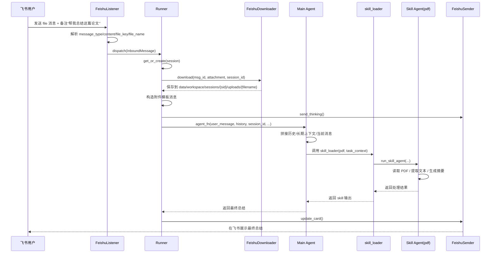

# 飞书上传论文后 EvoPaw 总结流程审查

日期：2026-04-22  
范围：审查“用户在飞书上传论文文档，并要求 EvoPaw 总结论文”这一条完整链路，重点关注消息流、附件处理、主 Agent 决策、Skill 调用、Skill 可靠性、测试覆盖和主要风险点。

## 一句话结论

这条链路在设计上是成立的：飞书消息会被转成 `InboundMessage`，附件会被下载到 session 工作区，再由主 Agent 通过 `skill_loader` 决定是否调用 `pdf` 等文件处理 Skill，最后把结果回发到飞书。

但它当前还不能算稳定的生产级能力。最核心的问题有两个：

1. `task skill` 子代理的工作目录传错了，导致 Skill 文档声明的 session 隔离和实际执行环境不一致。
2. `pdf` Skill 依赖的关键库没有被项目依赖和镜像环境完整保障，真实 PDF 提取很容易在运行时失败。

---

## 审查结论摘要

### 关键发现

| 严重级别 | 结论 | 位置 |
|---|---|---|
| Critical | `skill_loader` 告诉模型当前工作目录是 `/workspace/sessions/{sid}`，但真正启动 task sub-agent 时传的是 `/workspace`，会破坏 session 级文件隔离。 | `evopaw/tools/skill_loader.py:118-124` `evopaw/tools/skill_loader.py:155-163` `evopaw/tools/skill_loader.py:287-300` `evopaw/agents/skill_agent.py:24-49` |
| High | 上传 PDF 后能否成功提取文本，强依赖 `pypdf` / `pdfplumber`，但项目依赖里只有 `PyPDF2`。 | `evopaw/skills/pdf/SKILL.md:15-26` `evopaw/skills/pdf/SKILL.md:79-118` `requirements.txt:24-26` `pyproject.toml:21-23` |
| High | 如果用户只发文件、不发“帮我总结”之类的文字备注，系统不会被代码硬性要求执行“总结”，而是交给模型自己推断意图。 | `evopaw/feishu/listener.py:283-300` `evopaw/runner.py:47-55` |
| High | PDF、DOCX、PPTX 等文件 Skill 的选择主要依赖模型规划，不是代码层的强扩展名路由。 | `evopaw/agents/main_agent.py:117-125` `evopaw/tools/skill_loader.py:96-126` `evopaw/skills/load_skills.yaml:9-25` |
| Medium | 真正的“上传真实文件并处理内容”的 E2E 并没有被当前测试覆盖，现有集成测试只验证意图识别。 | `tests/integration/test_e2e_conversation.py:452-507` |
| Medium | 手工启动模式对 `/workspace`、`/mnt/skills` 的路径假设不稳，这些路径当前主要由 Docker 镜像准备。 | `Dockerfile:29-33` |

### 当前能力的真实判断

- 如果你在飞书里上传一个文本型 PDF，并明确写上“帮我总结这篇论文，重点讲方法、实验和结论”，主流程大概率可以跑通。
- 如果你只发文件、不写文字，系统可能会总结，也可能只是泛化处理附件，行为不够确定。
- 如果 PDF 是扫描件，或者环境里缺失 `pypdf` / `pdfplumber`，成功率会明显下降。
- 如果不是在 Docker 的预设沙盒里跑，而是直接在宿主机手工启动，路径假设会进一步变脆。

---

## 端到端流程

下面按“用户在飞书上传一个论文 PDF，并同时说‘帮我总结这篇论文’”的标准场景展开。

### 时序图



### 详细分解

#### 1. 飞书事件接入

`FeishuListener` 监听 `im.message.receive_v1`。当收到消息时，它会：

- 解析消息元信息，包括 `chat_type`、`chat_id`、`thread_id`、`sender_open_id`
- 生成当前对话的 `routing_key`
- 提取正文文本 `content`
- 提取附件元信息 `attachment`
- 封装成统一的 `InboundMessage`

相关位置：

- `evopaw/feishu/listener.py:98-137`
- `evopaw/feishu/listener.py:182-229`
- `evopaw/feishu/listener.py:283-300`

这里有一个重要事实：

- `text` 和 `post` 消息才会提取正文文本。
- `file` 消息本身不会自动带出“请总结”这样的意图文本。
- 所以如果用户只上传文件，`content` 默认是空字符串。

#### 2. Session 归属

`Runner.dispatch()` 按 `routing_key` 进入串行队列，同一会话串行执行，不同会话并行执行。

相关位置：

- `evopaw/runner.py:80-93`
- `evopaw/runner.py:113-145`

这意味着：

- 同一私聊用户后续继续追问“这篇论文的创新点是什么”，通常会落到同一个 session
- 上一轮的文件路径描述和结果会进入会话历史

#### 3. 附件下载

如果 `InboundMessage` 里有附件，`Runner` 会调用 `FeishuDownloader` 从飞书 API 下载文件。

下载目标目录：

`data/workspace/sessions/{session_id}/uploads/{file_name}`

对 LLM 暴露的沙盒路径：

`/workspace/sessions/{session_id}/uploads/{file_name}`

相关位置：

- `evopaw/runner.py:162-179`
- `evopaw/feishu/downloader.py:27-70`

#### 4. 对用户消息做“附件模板化”

下载成功后，`Runner` 不会把文件内容直接塞进 prompt，而是把用户消息改造成一段模板文本：

```text
用户发来了文件，已自动保存至沙盒路径：
`/workspace/sessions/{sid}/uploads/xxx.pdf`
请根据文件内容和用户意图完成相应处理。
用户备注：帮我总结这篇论文
```

相关位置：

- `evopaw/runner.py:47-55`
- `evopaw/runner.py:173-176`

这个设计有两个直接后果：

1. 主 Agent 首先看到的是“文件路径 + 任务说明”，不是文件正文。
2. 如果没有“用户备注”，那就只剩“请根据文件内容和用户意图完成处理”这句通用提示。

#### 5. 飞书占位回复

`Runner` 会先发一个“思考中，请稍候...”的交互式卡片，再执行主 Agent。

相关位置：

- `evopaw/runner.py:183-184`
- `evopaw/feishu/sender.py:83-113`

用户在飞书里的体验是：

- 先看到一个 loading 卡片
- 后面这个卡片会被 PATCH 成最终总结结果

#### 6. 主 Agent 组装上下文

主 Agent 会把这些内容拼到一起：

- Bootstrap system prompt
- 长期上下文摘要 `ctx.json`
- 最近若干轮会话历史
- 当前这条“附件路径提示”

相关位置：

- `evopaw/agents/main_agent.py:114-138`

同时，主 Agent 被明确约束：

- 不允许直接用 Claude CLI 的内置 skill
- 所有文件处理能力都要通过 `skill_loader`

相关位置：

- `evopaw/agents/main_agent.py:117-125`

#### 7. 图片附件与普通文件附件的分流

这里需要特别说明：

- 只有图片附件会走真正的多模态输入路径
- 普通 PDF 不会

原因是 `extract_image_path()` 只识别图片后缀名。

相关位置：

- `evopaw/agents/main_agent.py:140-151`
- `evopaw/tools/add_image_tool_local.py:36-39`
- `evopaw/tools/add_image_tool_local.py:110-126`

所以：

- 上传 JPG、PNG 时，Claude 能直接“看图”
- 上传 PDF 时，Claude 只是知道“有个 PDF 文件放在这个路径里”，真正的读取工作要靠 Skill 完成

#### 8. Skill 决策

主 Agent 拿到附件路径后，需要自己决定是否调用 `skill_loader`，以及选哪个 Skill。

当前可用 Skill 列表由 `load_skills.yaml` 决定，文件处理相关包括：

- `pdf`
- `docx`
- `pptx`
- `xlsx`

相关位置：

- `evopaw/skills/load_skills.yaml:9-25`
- `evopaw/tools/skill_loader.py:96-126`

注意，这里不是代码硬路由，而是“模型看到 skill 描述后自行规划”。  
理论上，主 Agent 应该因为看到 `.pdf` 路径而选择 `pdf` Skill；但这不是代码层面的强约束。

#### 9. `skill_loader` 的工作方式

`skill_loader` 采用两阶段模式：

1. 在工具 description 中只暴露各个 skill 的简要描述
2. 真正调用某个 skill 时，才读取完整的 `SKILL.md`

相关位置：

- `evopaw/tools/skill_loader.py:96-126`
- `evopaw/tools/skill_loader.py:129-169`

对 `reference` 型 Skill：

- 直接返回说明文本，不启动 sub-agent

对 `task` 型 Skill：

- 读取完整 `SKILL.md`
- 补上 `execution_directive`
- 启动一个短生命周期的 Skill sub-agent

相关位置：

- `evopaw/tools/skill_loader.py:268-301`

#### 10. `pdf` Skill 执行

理论上，上传论文 PDF 后会进入 `pdf` Skill。它的说明明确写着：

- 只要涉及 `.pdf`，都应该使用这个 Skill
- 读取 PDF 用 `pypdf`
- 版面文本、表格提取用 `pdfplumber`

相关位置：

- `evopaw/skills/pdf/SKILL.md:1-4`
- `evopaw/skills/pdf/SKILL.md:15-26`
- `evopaw/skills/pdf/SKILL.md:79-118`

Skill sub-agent 的可用工具只有：

- `Bash`
- `Read`
- `Write`
- `Edit`
- `Grep`
- `Glob`

相关位置：

- `evopaw/llm/claude_client.py:59-68`

所以它会自己在沙盒中执行：

- 打开 `/workspace/sessions/{sid}/uploads/paper.pdf`
- 尝试抽取正文
- 再基于正文生成摘要

#### 11. 返回主 Agent 与飞书回复

Skill 结果返回主 Agent 后，主 Agent 再整合成最终回答。  
`Runner` 会把本轮用户消息和回复写入 session 历史，再把飞书 loading 卡片改成最终内容。

相关位置：

- `evopaw/runner.py:186-204`
- `evopaw/feishu/sender.py:115-133`

---

## 与本场景直接相关的 Skill 审核

### `pdf` Skill

#### 角色

这是“上传本地论文 PDF 后做总结”的主 Skill。

#### 设计是否合理

设计方向是合理的：

- 让主 Agent 不直接读 PDF，而是把 PDF 处理交给专门 Skill
- Skill 里明确了常见 PDF 处理方式
- 适合作为统一的 PDF 能力入口

#### 当前问题

1. 它依赖 `pypdf` 和 `pdfplumber`，但项目依赖没把这两个库完整安装进去。
2. 如果 PDF 是扫描版，Skill 虽然文案上提到了 OCR，但运行环境并没有形成被项目级保障的 OCR 工具链。
3. 它假定 session 工作目录、`uploads/outputs/tmp` 路径契约成立，但当前 task sub-agent `cwd` 实际上传错了。

#### 结论

`pdf` Skill 的“能力定义”基本没问题，真正的问题在于执行环境没有和 Skill 约定对齐。

### `arxiv_search` Skill

#### 角色

这个 Skill 适合：

- 根据关键词搜索 arXiv
- 根据 arXiv ID 获取论文信息
- 下载指定 arXiv 论文 PDF

相关位置：

- `evopaw/skills/arxiv_search/SKILL.md:17-37`

#### 是否会用于“上传本地论文文件并总结”

通常不会。

因为你的场景是：

- 文件已经由用户上传到飞书
- 文件已经落到本地 session `uploads/`

这时主任务应该是“读取本地文件”，不是“去 arXiv 搜索或下载论文”。

#### 结论

`arxiv_search` 本身没有明显设计问题，但它不是这条链路的核心 Skill，不应被误当成“上传论文总结”的主能力。

### `history_reader` Skill

#### 角色

`history_reader` 是 `reference` 型 Skill，由系统内联处理，不启 sub-agent。

相关位置：

- `evopaw/skills/history_reader/SKILL.md:1-18`
- `evopaw/tools/skill_loader.py:268-271`

#### 在本场景中的作用

首轮总结通常不需要它。  
只有在后续追问时，如果“上传文件那轮”的消息已经超出主 Agent 当前注入的最近历史窗口，才可能需要它回读更早的记录。

#### 结论

这个 Skill 设计比较稳，对本链路是辅助能力，不是主链路风险点。

### `feishu_ops` Skill

#### 角色

它用于：

- 主动向飞书发送文本、文件、图片
- 读取飞书云文档
- 创建飞书文档或表格等

#### 在本场景中的作用

纯“总结论文并在飞书回复一段文本”时，一般不会用到它。  
因为正常回复走的是原生 `FeishuSender`，不是 Skill。

它更可能在这些场景被用到：

- Skill 生成了一个新的报告 PDF，想回传给用户
- Skill 想把处理结果保存成飞书文档再发链接

#### 结论

`feishu_ops` 不是当前“上传论文后回复摘要”这条主链路的关键依赖。

### `docx` / `pptx` Skill

#### 角色

这两个 Skill 分别处理 Word 和 PowerPoint。

#### 当前问题

- `docx` 依赖 `pandoc`、`soffice`、`pdftoppm` 等系统工具  
  相关位置：`evopaw/skills/docx/SKILL.md:15-44`
- `pptx` 依赖 `markitdown`  
  相关位置：`evopaw/skills/pptx/SKILL.md:11-29`

本次检查时本机结果是：

- `pypdf: missing`
- `pdfplumber: missing`
- `markitdown: missing`
- `pandoc: missing`
- `soffice: /usr/bin/soffice`
- `pdftoppm: /usr/bin/pdftoppm`

#### 结论

如果用户发来的“论文”不是 PDF，而是 DOCX 或 PPTX，当前环境可靠性只会更差，不会更好。

---

## 当前链路最重要的问题详解

### 1. Skill 工作目录错误

这是本次审查里最严重的问题。

`skill_loader` 在说明里明确告诉模型：

- 当前 session 工作目录是 `/workspace/sessions/{sid}`
- 用户上传文件在 `/workspace/sessions/{sid}/uploads`
- 输出目录在 `/workspace/sessions/{sid}/outputs`
- 临时目录在 `/workspace/sessions/{sid}/tmp`

相关位置：

- `evopaw/tools/skill_loader.py:118-124`
- `evopaw/tools/skill_loader.py:155-163`

但真正调用 `run_skill_agent()` 时，传入的是：

```python
session_path="/workspace"
```

相关位置：

- `evopaw/tools/skill_loader.py:291-300`

而 `run_skill_agent()` 会直接把这个值当作 `cwd`：

- `evopaw/agents/skill_agent.py:24-49`

风险是：

- Skill 如果用相对路径读写文件，可能会把文件写到错误位置
- `outputs/`、`tmp/` 目录可能不在预期 session 下
- Skill 文档和实际环境不一致，会增加模型执行失败概率

这不是“提示词瑕疵”，而是执行环境契约错误。

### 2. `pdf` Skill 依赖不完整

`pdf` Skill 说明假设子代理可以直接导入：

- `pypdf`
- `pdfplumber`

但项目依赖里只有：

- `PyPDF2`

相关位置：

- `evopaw/skills/pdf/SKILL.md:15-26`
- `evopaw/skills/pdf/SKILL.md:79-118`
- `requirements.txt:24-26`
- `pyproject.toml:21-23`

这会造成一个典型问题：

- Skill 指南是对的
- 模型也会按指南写正确代码
- 但运行时 import 直接失败

也就是说，这不是模型不会用，而是环境没有兑现 Skill 文档承诺。

### 3. 文件 Skill 选择没有强规则化

当前结构里，主 Agent 并没有这样的硬规则：

- 如果上传的是 `.pdf`，就必须调用 `pdf`
- 如果上传的是 `.docx`，就必须调用 `docx`

它只是看到了一个 skill 注册表和每个 skill 的 description，然后自己决定是否调用。

这会带来两个问题：

1. 行为稳定性依赖模型规划质量。
2. 对“只上传文件、不加说明”的场景，意图推断更不稳定。

### 4. `outputs/` 和 `tmp/` 的目录契约虽然存在，但主流程没有确保初始化

清理服务里有一个 `ensure_workspace_dirs()`，它会创建：

- `uploads`
- `outputs`
- `tmp`

相关位置：

- `evopaw/cleanup/service.py:143-147`

但主链路里，当前真正能确认被主动创建的只有：

- session 根目录
- `uploads/`

其中：

- session 根目录在主 Agent 里创建  
  `evopaw/agents/main_agent.py:153-155`
- `uploads/` 在 downloader 里创建  
  `evopaw/feishu/downloader.py:38-42`

这意味着：

- 如果 Skill 假设 `outputs/`、`tmp/` 一定已存在，可能会遇到目录不存在的问题
- 虽然很多 Skill 可以自己创建目录，但这不应依赖模型临场发挥

---

## 行为边界与实际表现

### 场景 A：只上传文件，不发任何文字

系统会做的事情：

- 下载文件
- 告诉主 Agent 文件在 `/workspace/sessions/{sid}/uploads/...`
- 给出一句通用提示：“请根据文件内容和用户意图完成相应处理”

系统不会做的事情：

- 不会由代码明确下达“总结这篇论文”指令
- 不会由代码强制选择 `pdf` Skill

因此这个场景下的实际行为更依赖模型推断，不够确定。

### 场景 B：上传文件，并说“帮我总结这篇论文”

这是当前最合理、最稳定的交互方式。

因为主 Agent 同时得到：

- 文件路径
- 明确意图

这时它选择 `pdf` Skill 的概率最高，最终给出摘要也最符合预期。

### 场景 C：先发文件，后发“帮我总结这篇论文”

通常也能工作，因为：

- 同一 `routing_key` 会落到同一个 session
- 文件路径那条消息会进入会话历史

但如果后续对话很长，历史被截断，主 Agent 才可能需要 `history_reader` 帮它回读更早消息。

---

## 测试与验证情况

### 已验证内容

本次审查中已运行与这条链路直接相关的单元测试：

```bash
python3 -m pytest \
  tests/unit/test_runner.py \
  tests/unit/test_skill_loader.py \
  tests/unit/test_downloader.py \
  tests/unit/test_skill_agent.py \
  tests/unit/test_feishu_listener.py -q
```

结果：

```text
152 passed, 16 warnings
```

这些测试证明：

- 飞书消息能被转成统一的 `InboundMessage`
- 附件下载器能按 session 写入 `uploads/`
- `Runner` 能把附件路径模板传给 Agent
- `skill_loader` 能暴露 skill 注册表并组装 Skill 指令
- `skill_agent` 的基础调用封装本身没有明显异常

### 尚未被证明的内容

当前测试没有真正证明以下关键事实：

1. 一个真实上传的 PDF 论文一定能被 `pdf` Skill 正确读出正文
2. `pypdf` / `pdfplumber` 缺失时，系统是否能优雅降级
3. task sub-agent 在真实沙盒里是否按 session 正确写入输出
4. “飞书上传真实文件 -> 摘要 -> 回飞书”这条全链路是否稳定

现有集成测试明确说明：

- 这里只测试 Agent 的意图识别和响应
- 不上传真实文件

相关位置：

- `tests/integration/test_e2e_conversation.py:452-507`

### 一个额外值得注意的测试错位

`test_skill_agent.py` 认为 `run_skill_agent()` 的 `cwd` 应该是 `/workspace/sessions/{sid}`：

- `tests/unit/test_skill_agent.py:61-82`

这个测试本身没问题，但生产代码在 `skill_loader` 里传的其实是 `/workspace`。  
也就是说，测试验证的契约和生产实际使用的契约已经发生了偏离。

---

## 风险判断

### 当前最可能失败的地方

1. `pdf` Skill 在提取文本时 import 失败
2. Skill 写文件到错误目录，导致后续找不到结果文件
3. 用户只发文件、不发说明，主 Agent 没有稳定理解“要做总结”
4. 宿主机手工启动时，`/workspace`、`/mnt/skills` 不存在或映射不一致

### 当前最适合的使用方式

如果现在必须用这条能力，建议采用以下交互方式：

1. 使用 Docker 环境运行
2. 上传可提取文本的 PDF，而不是扫描件
3. 同时发送明确备注，例如“请帮我总结这篇论文，重点是方法、实验、结论和局限性”

这不是从产品角度的理想用法，而是当前代码现实下的最稳用法。

---

## 修复优先级建议

虽然本次不改代码，但从工程优先级看，后续应按这个顺序处理：

1. 修正 `skill_loader -> run_skill_agent()` 的 `session_path`，确保 task sub-agent 的 `cwd` 真正指向 `/workspace/sessions/{sid}`。
2. 补齐 `pdf` Skill 所需依赖，至少让 `pypdf`、`pdfplumber` 与 Skill 文档一致。
3. 对上传文件增加代码级别的强扩展名路由，不要完全依赖模型自行决定是否调用 `pdf`/`docx`/`pptx`。
4. 在主流程里确保 `uploads/outputs/tmp` 三个目录都存在。
5. 增加真实文件 E2E 测试，用一个最小真实 PDF 验证“上传 -> 读取 -> 摘要 -> 回复”的全链路。
6. 明确宿主机启动与 Docker 启动的路径契约，避免 Skill 文档只在容器里成立。

---

## 最终结论

如果只回答“用户在飞书上传论文，EvoPaw 会怎么做”，答案是：

它会把飞书文件下载到当前 session 的 `uploads/` 目录，把文件路径包装成一条提示词交给主 Agent，然后主 Agent 大概率通过 `skill_loader` 调用 `pdf` Skill 去读取论文内容，最后把摘要结果通过飞书卡片回给用户。

如果回答“这条链路现在是否可靠”，答案是否定的。

它的总体架构方向没有问题，但当前还存在明显的执行环境错配：

- Skill 的工作目录契约不一致
- Skill 文档依赖与项目依赖不一致
- 关键 E2E 路径没有真正被覆盖

所以，现阶段这条能力更准确的定义应当是：

> 功能方向明确、主流程基本成型，但文件处理这段仍处在“能演示、未稳定”的状态。
