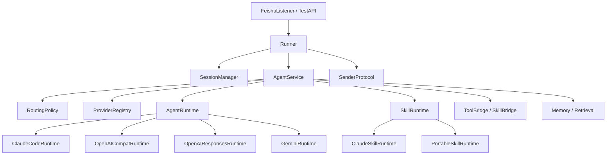

# EvoPaw 多模型改造设计文档

日期：2026-04-23  
状态：Proposed  
范围：`evopaw` 主运行时、Skill 运行时、配置层、provider 路由层、观测与回退策略  
不包含：本次文档不直接修改业务代码

---

## 1. 结论先行

`evopaw` 当前的问题不是“只支持 Claude 模型”，而是：

> `evopaw` 的对话运行时、任务型 Skill 运行时、工具暴露方式，整体都直接绑定在 `Claude Agent SDK -> Claude Code CLI` 这一条链路上。

这意味着现在要做多模型，不是简单把 `planner_model` 从 `claude-*` 改成 `gpt-*`，而是要把下面三层解耦：

1. 产品层：飞书监听、`Runner`、Session、Sender、附件下载、Slash 命令。
2. Agent runtime 层：主 Agent 调度、Skill Agent 调度、流式消息、工具调用、子代理、权限控制。
3. Provider 层：Claude / OpenAI / Gemini / OpenAI-compatible / 本地模型。

本设计文档的核心建议是：

1. 先把现有 Claude 路径包进统一 `AgentRuntime` 抽象，保持现有功能不变。
2. 再引入集中式 `ProviderRegistry` 和 `RoutingPolicy`，让多模型成为显式运行时选择，而不是散落在业务代码里的条件分支。
3. 最后分阶段引入新的 runtime family：先 `openai_compat`，再考虑 `openai_responses` / `gemini`。
4. 在相当长一段时间里，任务型 Skill 运行时仍应保留 Claude 兼容路径，因为它最重度依赖当前的 Claude Code agent 语义和 MCP 接入方式。

一句话概括：

> 多模型改造的第一阶段目标，不是“彻底去 Claude”，而是“让 Claude 不再是唯一可被接入的运行时”。

---

## 2. 文档目标

本文档要回答五个问题：

1. `evopaw` 当前到底卡死在哪些 Claude-specific 位置？
2. 目标架构应该长什么样？
3. provider、runtime、tool、skill 这四层应该怎么拆？
4. 哪些能力可以先多模型，哪些能力必须暂时保留 Claude 兼容层？
5. 应该按照什么顺序迁移，才能不把飞书主链路打崩？

---

## 3. 当前实现现状

### 3.1 启动入口显式依赖 Claude Code CLI

启动时直接检查 `claude` 是否在 PATH 中，不存在就报错退出：

- [evopaw/main.py](/home/hxd/agent_project/evopaw/evopaw/main.py:79)
- [evopaw/llm/claude_client.py](/home/hxd/agent_project/evopaw/evopaw/llm/claude_client.py:24)

这说明系统当前默认假设：

- 主 Agent 一定是 Claude Agent SDK
- Skill Sub-Agent 一定是 Claude Agent SDK

### 3.2 主 Agent 直接调用 `claude_agent_sdk.query()`

主 Agent 在 `build_agent_fn()` 里直接 `async for message in query(...)`：

- [evopaw/agents/main_agent.py](/home/hxd/agent_project/evopaw/evopaw/agents/main_agent.py:14)
- [evopaw/agents/main_agent.py](/home/hxd/agent_project/evopaw/evopaw/agents/main_agent.py:182)

这里不仅绑定了 Claude 模型，还绑定了 Claude Code 的运行语义：

- `ClaudeAgentOptions`
- `permission_mode`
- `mcp_servers`
- Claude 风格的 `ResultMessage`

### 3.3 Skill Agent 也直接调用 `claude_agent_sdk.query()`

任务型 Skill 通过 `run_skill_agent()` 再起一层 Claude SDK 会话：

- [evopaw/agents/skill_agent.py](/home/hxd/agent_project/evopaw/evopaw/agents/skill_agent.py:12)
- [evopaw/agents/skill_agent.py](/home/hxd/agent_project/evopaw/evopaw/agents/skill_agent.py:51)

这意味着：

- 主 Agent 换运行时不够
- Skill 运行时也必须单独抽象

### 3.4 `skill_loader` 当前直接用 Claude SDK 的 MCP 工具装饰器

`skill_loader` 是通过 `create_sdk_mcp_server()` 和 `@tool` 暴露给主 Agent 的：

- [evopaw/tools/skill_loader.py](/home/hxd/agent_project/evopaw/evopaw/tools/skill_loader.py:239)
- [evopaw/tools/skill_loader.py](/home/hxd/agent_project/evopaw/evopaw/tools/skill_loader.py:303)

这意味着当前工具桥接层不是 provider-neutral 的，它天然站在 Claude SDK 语义上。

### 3.5 配置层当前只有“模型名”，没有 provider/runtime 概念

`config.yaml.template` 里只有：

- `agent.planner_model`
- `agent.sub_agent_model`

没有：

- provider
- runtime family
- base_url
- fallback provider
- per-role routing

见：

- [config.yaml.template](/home/hxd/agent_project/evopaw/config.yaml.template:17)

### 3.6 飞书产品壳本身其实是可复用的

`Runner` 当前负责：

- per-routing_key 串行队列
- Slash 命令拦截
- 附件下载
- 加载会话历史
- 调用 `agent_fn`
- 写回历史
- 更新飞书卡片

见：

- [evopaw/runner.py](/home/hxd/agent_project/evopaw/evopaw/runner.py:58)
- [evopaw/runner.py](/home/hxd/agent_project/evopaw/evopaw/runner.py:149)

这层其实与具体模型厂商几乎无关，是这次改造中最应该保护的资产。

### 3.7 实际 Claude 依赖链的最底层是 CLI 子进程

本地安装的 `claude_agent_sdk` 内部默认使用 `SubprocessCLITransport`，会查找 `claude` 可执行文件并拉起子进程：

- [/home/hxd/anaconda3/lib/python3.11/site-packages/claude_agent_sdk/client.py](/home/hxd/anaconda3/lib/python3.11/site-packages/claude_agent_sdk/client.py:136)
- [/home/hxd/anaconda3/lib/python3.11/site-packages/claude_agent_sdk/_internal/transport/subprocess_cli.py](/home/hxd/anaconda3/lib/python3.11/site-packages/claude_agent_sdk/_internal/transport/subprocess_cli.py:63)
- [/home/hxd/anaconda3/lib/python3.11/site-packages/claude_agent_sdk/_internal/transport/subprocess_cli.py](/home/hxd/anaconda3/lib/python3.11/site-packages/claude_agent_sdk/_internal/transport/subprocess_cli.py:343)

因此当前系统绑定的不是“Anthropic HTTP API”，而是“Claude Code runtime”。

---

## 4. 当前架构中最值得保留的部分

多模型改造时，以下能力应尽量保持不动或只做薄改造：

1. `FeishuListener` 和 `InboundMessage` 标准化消息入口  
   见 [evopaw/feishu/listener.py](/home/hxd/agent_project/evopaw/evopaw/feishu/listener.py:142)
2. `Runner` 的路由串行化、附件处理、slash command 机制  
   见 [evopaw/runner.py](/home/hxd/agent_project/evopaw/evopaw/runner.py:80)
3. `SessionManager` / 历史存储 / `ctx.json` / raw 日志
4. `skill_loader` 作为 Skill 注册表与 reference/task 分流的核心思想
5. 飞书 sender 协议 `SenderProtocol`  
   见 [evopaw/models.py](/home/hxd/agent_project/evopaw/evopaw/models.py:33)
6. 现有附件处理流程：下载到 session workspace，再注入沙盒路径

换句话说：

> 需要重写的是“Agent runtime 接口”，不是“飞书机器人产品壳”。

---

## 5. 改造目标

### 5.1 目标

1. 保持飞书入口、会话、附件、历史、sender 主流程不变。
2. 在不移除 Claude 路径的前提下，引入统一的 runtime 抽象。
3. 配置层显式支持 `provider/model/base_url/fallback`。
4. 第一批接入至少两类 runtime：
   - `claude_code`
   - `openai_compat`
5. 支持按角色路由：
   - planner
   - sub-agent
   - compression / memory summarization
   - lightweight extraction
6. 为后续引入 `OpenAI Responses` 或 `Gemini` 原生 runtime 留接口。
7. 将“哪些任务可以多模型、哪些任务暂时必须走 Claude”做成显式能力矩阵。

### 5.2 非目标

本轮设计不追求：

1. 一次性完全移除 `claude_agent_sdk`
2. 一次性把所有 Skill 都迁到新 runtime
3. 一次性统一所有厂商的 tool calling 语义
4. 一次性重写 memory 系统
5. 引入自我修改代码或 GitHub 自动演化流水线

---

## 6. 设计原则

1. **产品壳与 runtime 分离**  
   飞书、Session、Attachment、Sender 不应该知道 provider 细节。

2. **先兼容，再替换**  
   第一个新 runtime 进入后，Claude 路径仍然保留，作为对照和回退。

3. **provider 不是 runtime**  
   `OpenRouter`、`DeepSeek`、`本地 vLLM` 可以共享 `openai_compat` runtime family。

4. **能力显式建模**  
   不同 runtime 对工具、流式、图片、MCP、子代理的支持必须结构化描述，不能靠约定俗成。

5. **Skill 迁移分层处理**  
   reference 型 skill 与 task 型 skill 必须分开设计迁移方案。

6. **失败优先回退，不优先复杂化**  
   第一个可用版本应该允许“复杂场景仍回退 Claude”，而不是为了纯粹而降低可用性。

---

## 7. 目标架构

### 7.1 总体分层



### 7.2 核心思想

- `Runner` 只依赖 `AgentService`
- `AgentService` 决定这次调用用哪个 runtime
- `ProviderRegistry` 提供 provider 能力与默认配置
- `RoutingPolicy` 根据任务类型决定 provider/model/fallback
- `AgentRuntime` 负责主 Agent
- `SkillRuntime` 负责 task 型 Skill
- `ToolBridge` 负责把内部 tool/skill 能力映射到不同 runtime 的调用语义

---

## 8. 新的核心抽象

### 8.1 ProviderSpec

建议新增一个集中模块，例如：

- `evopaw/llm/provider_registry.py`

核心数据结构：

```python
@dataclass(frozen=True)
class ProviderSpec:
    name: str
    runtime_family: Literal[
        "claude_code",
        "openai_compat",
        "openai_responses",
        "gemini_native",
    ]
    api_key_env: str | None
    default_model: str
    base_url: str | None = None
    supports_streaming: bool = True
    supports_tools: bool = False
    supports_image_input: bool = False
    supports_native_mcp: bool = False
    supports_subagents: bool = False
    supports_permission_hooks: bool = False
```

### 8.2 ModelProfile

如果后续需要更强的路由和预算控制，再增加 `ModelProfile`：

```python
@dataclass(frozen=True)
class ModelProfile:
    provider: str
    model: str
    context_window: int | None
    cost_tier: Literal["cheap", "mid", "premium"]
    reasoning_tier: Literal["light", "strong"]
    supports_vision: bool
    supports_tools: bool
```

### 8.3 AgentRequest / AgentResult

建议统一主 Agent 的运行时接口：

```python
@dataclass
class AgentRequest:
    system_prompt: str
    user_message: str | list[dict[str, Any]]
    cwd: str
    session_id: str
    routing_key: str
    root_id: str
    history: list[MessageEntry]
    verbose: bool
    allowed_tools: list[str]
    tool_bindings: dict[str, Any]
    max_turns: int
    provider: str
    model: str
    metadata: dict[str, Any] = field(default_factory=dict)

@dataclass
class AgentResult:
    final_text: str
    provider: str
    model: str
    usage: dict[str, Any] = field(default_factory=dict)
    tool_calls: list[dict[str, Any]] = field(default_factory=list)
    warnings: list[str] = field(default_factory=list)
```

### 8.4 SkillRequest / SkillResult

```python
@dataclass
class SkillRequest:
    skill_name: str
    skill_type: Literal["reference", "task"]
    instructions: str
    task_context: str
    session_id: str
    routing_key: str
    cwd: str
    provider: str
    model: str
    metadata: dict[str, Any] = field(default_factory=dict)

@dataclass
class SkillResult:
    text: str
    provider: str
    model: str
    warnings: list[str] = field(default_factory=list)
```

---

## 9. Runtime family 设计

### 9.1 `ClaudeCodeRuntime`

这是第一阶段必须保留的兼容层。

职责：

- 继续封装 `claude_agent_sdk.query()`
- 继续支持当前 MCP server 接入
- 继续支持 Claude Code 内建工具
- 继续支持 verbose hooks
- 继续支撑 task 型 Skill 的 Claude 子代理执行

建议位置：

- `evopaw/llm/runtimes/claude_code.py`

注意：

- 当前的 `check_claude_cli()` 不应再由 `main.py` 直接调用，而应该成为 `ClaudeCodeRuntime.healthcheck()` 的一部分。
- 启动时是否强制检查，应由配置决定，而不是系统级硬编码。

### 9.2 `OpenAICompatRuntime`

这是第二阶段最划算的新 runtime。

覆盖场景：

- 本地 vLLM / Ollama / LM Studio
- OpenRouter
- DeepSeek 兼容端点
- xAI 兼容端点
- 其他 OpenAI-compatible 服务

职责：

- 统一实现文本 prompt
- 支持基础 streaming
- 支持 text-only 或 image+text 请求
- 支持有限的 tool calling
- 不要求原生 MCP

建议位置：

- `evopaw/llm/runtimes/openai_compat.py`

它最适合先承接这些任务：

- 文档摘要
- 轻量信息抽取
- 非工具密集型的聊天问答
- memory summarization / compression

### 9.3 `OpenAIResponsesRuntime`

这是第三阶段再考虑的原生路径。

适合场景：

- 更标准的 tool call
- reasoning 配置
- future-proof 的 OpenAI 官方路径

建议位置：

- `evopaw/llm/runtimes/openai_responses.py`

### 9.4 `GeminiRuntime`

优先级可以晚于 `openai_compat`。

适合场景：

- 多模态理解
- 长上下文
- 某些 extraction / OCR / PDF 理解任务

建议位置：

- `evopaw/llm/runtimes/gemini.py`

---

## 10. Skill 运行时设计

这是整个改造里最容易低估、实际最棘手的部分。

### 10.1 reference 型 Skill

这类 Skill 的输出是“指令文本”，由主 Agent 自己消化。

例如：

- 参考类规则
- 文档类 instruction
- history_reader 这种内联类能力

这类 Skill 本身几乎不依赖 Claude runtime，问题主要在主 Agent 是否能理解其输出。

结论：

- reference 型 Skill 可以较早进入多 runtime 体系
- 只要主 Agent 能消费返回文本，就不依赖 Claude Code 子代理

### 10.2 task 型 Skill

这类 Skill 现在本质上是“起一个 Claude Code Sub-Agent，给它 Bash/Read/Write/Edit/Grep/Glob”。

这是高度 Claude-specific 的能力模型。

结论：

- 在第一、第二阶段，task 型 Skill 应继续默认使用 `ClaudeSkillRuntime`
- 不应强行把所有 task 型 Skill 同时迁移到 `openai_compat`

### 10.3 未来的 `PortableSkillRuntime`

如果后续要让 task 型 Skill 跨 runtime，可考虑引入中间层：

```python
class PortableSkillRuntime(Protocol):
    async def execute(self, request: SkillRequest, tool_host: ToolHost) -> SkillResult: ...
```

前提是先统一内部 tool host 能力：

- 读文件
- 写文件
- shell
- grep
- glob
- ask_user

但这不是第一阶段任务。

---

## 11. ToolBridge / SkillBridge 设计

### 11.1 当前问题

`skill_loader` 目前直接暴露为 Claude SDK MCP 工具：

- [evopaw/tools/skill_loader.py](/home/hxd/agent_project/evopaw/evopaw/tools/skill_loader.py:239)

这意味着 tool 接口和 runtime 绑定了。

### 11.2 目标

把内部能力先抽象成统一 bridge，再由不同 runtime 适配：

```python
class ToolBridge(Protocol):
    def expose_for_runtime(self, runtime_family: str) -> Any: ...

class SkillBridge(Protocol):
    async def invoke_reference(...): ...
    async def invoke_task(...): ...
```

### 11.3 迁移策略

第一阶段不重写 `skill_loader` 的实现逻辑，只增加一层包装：

- Claude runtime 继续返回 `create_sdk_mcp_server(...)`
- 非 Claude runtime 先只暴露受限工具或根本不暴露 task 型 Skill

这样可以避免一开始就把 MCP 抽象做过重。

---

## 12. RoutingPolicy 设计

建议引入：

- `evopaw/llm/routing.py`

核心接口：

```python
@dataclass(frozen=True)
class RouteDecision:
    provider: str
    model: str
    fallback_provider: str | None = None
    fallback_model: str | None = None
    reason: str = ""

class RoutingPolicy(Protocol):
    def choose_main_agent(self, meta: dict[str, Any]) -> RouteDecision: ...
    def choose_skill_agent(self, skill_name: str, meta: dict[str, Any]) -> RouteDecision: ...
    def choose_memory_model(self, meta: dict[str, Any]) -> RouteDecision: ...
```

### 12.1 第一阶段默认策略

- 主 Agent：`claude_code / planner_model`
- task 型 Skill：`claude_code / sub_agent_model`
- memory compression：可选 `openai_compat`
- 轻量 extraction：可选 `openai_compat`

### 12.2 第二阶段增强策略

根据任务元数据路由：

- 附件类型
- 是否需要工具
- 是否需要图片理解
- 是否需要长上下文
- 是否需要高可靠输出

示例：

| 场景 | 推荐 runtime |
|---|---|
| 普通聊天 / 复杂推理 | `claude_code` |
| 文本摘要 | `openai_compat` |
| OCR / 图像理解 | `gemini` 或支持 vision 的 `openai_compat` |
| 高吞吐低成本批任务 | `openai_compat` |
| task skill with shell/file edits | `claude_code` |

---

## 13. 配置层改造

### 13.1 当前问题

当前配置是：

```yaml
agent:
  planner_model: "claude-sonnet-4-6"
  sub_agent_model: "claude-haiku-4-5"
```

这不够表达：

- provider
- runtime family
- fallback
- per-role model

### 13.2 建议的新配置结构

```yaml
llm:
  default_provider: "claude_code"
  providers:
    claude_code:
      runtime_family: "claude_code"
      model: "claude-sonnet-4-6"
    local_qwen:
      runtime_family: "openai_compat"
      base_url: "http://127.0.0.1:8000/v1"
      api_key_env: "LOCAL_LLM_API_KEY"
      model: "Qwen/Qwen3-32B"
    openrouter:
      runtime_family: "openai_compat"
      base_url: "https://openrouter.ai/api/v1"
      api_key_env: "OPENROUTER_API_KEY"
      model: "anthropic/claude-sonnet-4"

  roles:
    planner:
      provider: "claude_code"
      max_turns: 50
      fallback_provider: "openrouter"
    sub_agent:
      provider: "claude_code"
      max_turns: 20
    compression:
      provider: "local_qwen"
    extraction:
      provider: "local_qwen"
```

### 13.3 向后兼容策略

如果用户仍使用旧配置：

- `agent.planner_model` -> 自动映射为 `llm.roles.planner.model`
- `agent.sub_agent_model` -> 自动映射为 `llm.roles.sub_agent.model`
- 默认 provider 为 `claude_code`

这样可以平滑迁移。

---

## 14. 启动与健康检查设计

### 14.1 现状问题

当前系统在启动时统一检查 `claude` CLI，会阻止所有非 Claude 场景启动：

- [evopaw/main.py](/home/hxd/agent_project/evopaw/evopaw/main.py:79)

### 14.2 目标

健康检查应 runtime-specific：

- `ClaudeCodeRuntime.healthcheck()`
- `OpenAICompatRuntime.healthcheck()`
- `GeminiRuntime.healthcheck()`

### 14.3 启动行为建议

1. 启动时只检查“默认 provider + 关键 fallback”是否可用。
2. 非默认 provider 允许懒检查。
3. `/doctor` 或 test API 可触发全量检查。

这样本地开发时：

- 可以只起 `openai_compat` 本地模型
- 不必被 `claude` CLI 阻塞

---

## 15. 附件与多模型关系

### 15.1 当前附件流程

当前流程：

1. 飞书收到附件
2. 下载到 session `uploads/`
3. `Runner` 把消息改写成“文件在 /workspace/...”
4. 主 Agent 决定是否调用 `skill_loader`

见：

- [evopaw/runner.py](/home/hxd/agent_project/evopaw/evopaw/runner.py:162)

### 15.2 设计建议

附件处理本身不应该感知 provider，但 routing policy 应该看附件类型：

- 图片：允许选择支持 vision 的 runtime
- PDF/Office 文档：仍优先用现有 skill 流程
- 纯文本：可走任意 text runtime

### 15.3 重要结论

第一阶段不要重写附件主链路。  
应先实现：

- `extract_image_path()` 场景下的多 runtime 输入适配
- 非图片附件继续走现有 skill 体系

---

## 16. 可移植能力矩阵

这是本设计最关键的一张表。

| 能力 | ClaudeCodeRuntime | OpenAICompatRuntime | OpenAIResponsesRuntime | GeminiRuntime |
|---|---|---:|---:|---:|
| 纯文本对话 | Yes | Yes | Yes | Yes |
| 基础流式输出 | Yes | Yes | Yes | Yes |
| 图片输入 | Yes | Depends | Yes | Yes |
| 原生 MCP server | Yes | No | No | No |
| Claude 风格内建 tools | Yes | No | No | No |
| task 型 skill 子代理 | Yes | No | Partial | Partial |
| shell/file edit agent loop | Yes | Partial | Partial | No |
| verbose hooks | Yes | Partial | Partial | Partial |
| permission hooks | Yes | No | Partial | No |
| 复杂现有 skill_loader 兼容 | Yes | Low | Medium | Low |

结论：

1. `ClaudeCodeRuntime` 必须长期存在，至少作为高级能力兼容层。
2. `OpenAICompatRuntime` 适合先承接轻量、非 MCP、非子代理场景。
3. “多模型支持”与“完全替代 Claude runtime”不是同一件事。

---

## 17. 建议新增的代码边界

建议新增或重构如下模块。

### 17.1 新增

```text
evopaw/llm/provider_registry.py
evopaw/llm/runtime_types.py
evopaw/llm/runtime_router.py
evopaw/llm/routing.py
evopaw/llm/runtimes/base.py
evopaw/llm/runtimes/claude_code.py
evopaw/llm/runtimes/openai_compat.py
evopaw/llm/runtimes/openai_responses.py
evopaw/llm/runtimes/gemini.py
evopaw/agents/agent_service.py
evopaw/tools/tool_bridge.py
evopaw/tools/skill_bridge.py
```

### 17.2 收口现有文件

- `evopaw/llm/claude_client.py`
  - 保留 Claude 相关 options 构建逻辑
  - 但只给 `ClaudeCodeRuntime` 使用

- `evopaw/agents/main_agent.py`
  - 不再直接 import `query`
  - 改为构建 `AgentRequest` 并调用 `AgentService`

- `evopaw/agents/skill_agent.py`
  - 不再成为通用 skill 入口
  - 改成 `ClaudeSkillRuntime` 的一个内部实现

- `evopaw/tools/skill_loader.py`
  - 保留技能注册表与 reference/task 分流逻辑
  - 但不再直接假设“所有 task 都走 Claude query”

---

## 18. 分阶段迁移方案

### Phase 0：文档和观测先行

目标：

- 明确当前运行链路
- 标准化日志字段
- 明确 provider / model / runtime 的观测维度

输出：

- 本设计文档
- 观测指标设计

### Phase 1：引入 runtime 抽象，行为不变

目标：

- 新增 `AgentRuntime` / `SkillRuntime` / `AgentService`
- 让主 Agent 和 Skill Agent 都通过抽象调用
- 底层仍然只接 `ClaudeCodeRuntime`

成功标准：

- 行为不变
- 测试不退化
- 启动仍可用

### Phase 2：引入 `ProviderRegistry` 和新配置

目标：

- 增加 `llm.providers` / `llm.roles`
- 实现 provider 配置解析和健康检查
- 保持默认 provider 为 `claude_code`

成功标准：

- 旧配置仍兼容
- `/doctor` 能区分 provider 可用性

### Phase 3：接入 `OpenAICompatRuntime`

目标：

- 支持 `openai_compat` family
- 支持至少一个本地或兼容 endpoint
- 支持文本对话与基础流式

成功标准：

- 非复杂文本任务可切到新 provider
- 不影响 Claude 主链路

### Phase 4：把轻量任务路由出去

目标：

- memory compression
- 轻量 extraction
- 简单文本摘要

这些场景先切到 `openai_compat`

成功标准：

- 主链路仍稳定
- 成本和可用性更优

### Phase 5：引入 fallback / role routing

目标：

- planner fallback
- compression fallback
- extraction fallback

成功标准：

- 主 provider 故障时仍能回复

### Phase 6：评估 task 型 Skill 的可移植化

目标：

- 先盘点 task 型 Skill 对 Claude runtime 的依赖深度
- 再选择一两个最简单 Skill 做 portable prototype

成功标准：

- 至少一类 task skill 能在非 Claude runtime 跑通

---

## 19. 测试策略

### 19.1 单元测试

新增测试重点：

- provider registry 解析
- route decision
- 旧配置到新配置的兼容映射
- runtime healthcheck
- fallback 选择逻辑

### 19.2 运行时 contract tests

每个 runtime family 至少应有：

- 文本 prompt -> 文本输出
- streaming 收敛
- error handling
- timeout handling

### 19.3 集成测试

围绕 `Runner -> AgentService -> Runtime` 做集成验证：

- 普通文本消息
- 附件消息
- slash command
- skill_loader reference skill

### 19.4 灰度测试

第一阶段上线时，建议做“双跑但单写”或日志影子模式：

- 主回复仍由 Claude 返回
- 新 runtime 在后台执行并记录差异

这样可以先评估质量，而不是立刻切流量。

---

## 20. 风险与应对

### 风险 1：把 runtime 抽象做成空壳

表现：

- 表面上有接口
- 实际每个调用点还是写满 Claude-specific 逻辑

应对：

- 严格禁止在 `main_agent.py` / `runner.py` 再直接 import `claude_agent_sdk`

### 风险 2：过早抽象 task 型 Skill

表现：

- 试图一步统一所有 tool / subagent / MCP 语义
- 导致工程体量失控

应对：

- 第一阶段把 task 型 Skill 明确归类为 `ClaudeSkillRuntime` 专属能力

### 风险 3：配置层失控

表现：

- provider、role、fallback、model、base_url 到处都有覆盖逻辑

应对：

- 所有解析逻辑集中在 `ProviderRegistry + RoutingPolicy`

### 风险 4：观测不足导致灰度期难排障

应对：

- 每次请求记录：
  - chosen_provider
  - chosen_model
  - runtime_family
  - fallback_used
  - latency_ms
  - task_kind

---

## 21. 开放问题

当前仍有几个需要后续决策的问题：

1. `openai_compat` 初版要不要支持 tool calling，还是先做 text-only？
2. 图片理解优先接哪条路径：Gemini 还是 OpenAI-compatible vision？
3. `skill_loader` 对非 Claude runtime 是否需要降级成“reference-only mode”？
4. memory summarization 是否应当先从主 Agent 中彻底剥离，独立成 role？
5. 是否要引入 per-workspace 或 per-tenant provider 配置？

---

## 22. 最终建议

如果只能给一个执行建议，那就是：

> 先做 `AgentService + ProviderRegistry + ClaudeCodeRuntime` 这一层收口，再接 `OpenAICompatRuntime`，不要反过来。

原因很简单：

- 没有 runtime 抽象时，新增第二家 provider 只会复制耦合
- 有了 runtime 抽象后，Claude 仍能继续跑，迁移就有安全垫
- `openai_compat` 是成本最低、覆盖面最大的第二条 runtime 路
- 任务型 Skill 暂时继续走 Claude，是最现实的工程折中

因此推荐实施顺序为：

1. 收口现有 Claude 调用链
2. 定义 provider registry 和新配置结构
3. 接入 `openai_compat`
4. 只迁移轻量场景
5. 最后再考虑 Skill 可移植化

---

## 23. 相关参考

### 本仓库现有文档

- [docs/hermes-vs-nanobot-multi-provider-analysis-2026-04-22.md](/home/hxd/agent_project/evopaw/docs/hermes-vs-nanobot-multi-provider-analysis-2026-04-22.md)
- [docs/improved_agent/yoyo-evolve-analysis-for-evopaw-2026-04-23.md](/home/hxd/agent_project/evopaw/docs/improved_agent/yoyo-evolve-analysis-for-evopaw-2026-04-23.md)
- [docs/improved_agent/hermes-agent-improvement-plan.md](/home/hxd/agent_project/evopaw/docs/improved_agent/hermes-agent-improvement-plan.md)

### 本地代码入口

- [evopaw/main.py](/home/hxd/agent_project/evopaw/evopaw/main.py:79)
- [evopaw/llm/claude_client.py](/home/hxd/agent_project/evopaw/evopaw/llm/claude_client.py:24)
- [evopaw/agents/main_agent.py](/home/hxd/agent_project/evopaw/evopaw/agents/main_agent.py:182)
- [evopaw/agents/skill_agent.py](/home/hxd/agent_project/evopaw/evopaw/agents/skill_agent.py:51)
- [evopaw/tools/skill_loader.py](/home/hxd/agent_project/evopaw/evopaw/tools/skill_loader.py:239)
- [evopaw/runner.py](/home/hxd/agent_project/evopaw/evopaw/runner.py:149)
- [config.yaml.template](/home/hxd/agent_project/evopaw/config.yaml.template:17)
